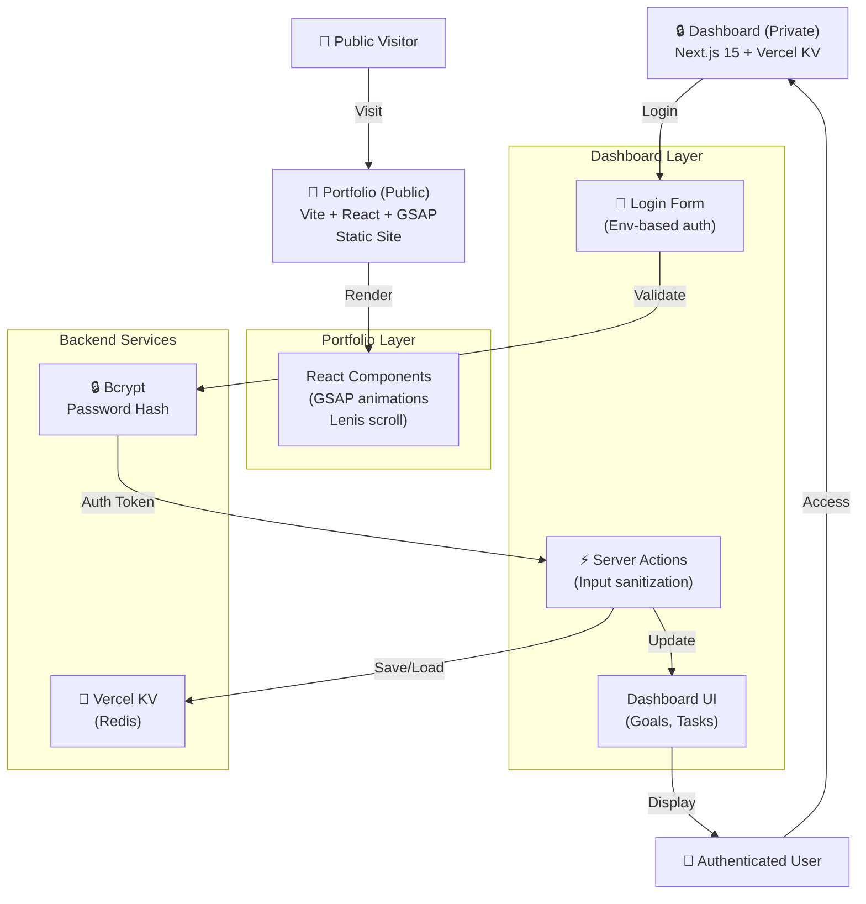

# FEU-workshop

Monorepo with two Vercel projects:

| App | Path | Stack | Vercel project |
|-----|------|-------|---------------|
| Public portfolio | `portfolio/` | Vite + React + GSAP + Lenis | `portfolio` |
| Personal dashboard (private) | `dashboard/` | Next.js 15 App Router + Vercel KV | `dashboard` *(create new)* |

The portfolio is statically rendered. The dashboard is server-rendered, gated by an env-only username + bcrypt password hash, with Server Actions doing all input sanitization.

## Local development

```bash
# Portfolio (Vite, port 5173)
npm --workspace portfolio run dev

# Dashboard (Next.js, port 3001)
cd dashboard
cp .env.example .env.local
npm install
npm run hash-password   # paste output into .env.local as DASHBOARD_PASSWORD_HASH
npm run dev
```

## First-time deploy of the dashboard

1. **Generate the password hash locally** — never type it into the Vercel UI as a plain password:
   ```bash
   cd dashboard && npm run hash-password
   ```
2. **Create a Vercel project** for `dashboard/` (Framework preset: Next.js, Root directory: `dashboard`).
3. **Set environment variables** in the new Vercel project:
   - `DASHBOARD_USERNAME` — your username
   - `DASHBOARD_PASSWORD_HASH` — the bcrypt hash from step 1
   - `AUTH_SECRET` — `openssl rand -base64 48`
4. **Provision Vercel KV** in the same project (Storage → KV → Create). The `KV_*` env vars auto-link.
5. **Set the portfolio's `VITE_DASHBOARD_URL`** to the dashboard's Vercel URL so the Sign-in button points at the right host.

## CI

`.github/workflows/ci.yml` runs on every PR and `main` push:

- Portfolio: `tsc -b` + `vite build`
- Dashboard: `tsc --noEmit` + `next build` (with dummy CI-only env)
- Secrets scan: gitleaks

CI does not deploy — Vercel handles deploys via its own GitHub integration once you connect the repo to each project.

## Architecture (UML)

